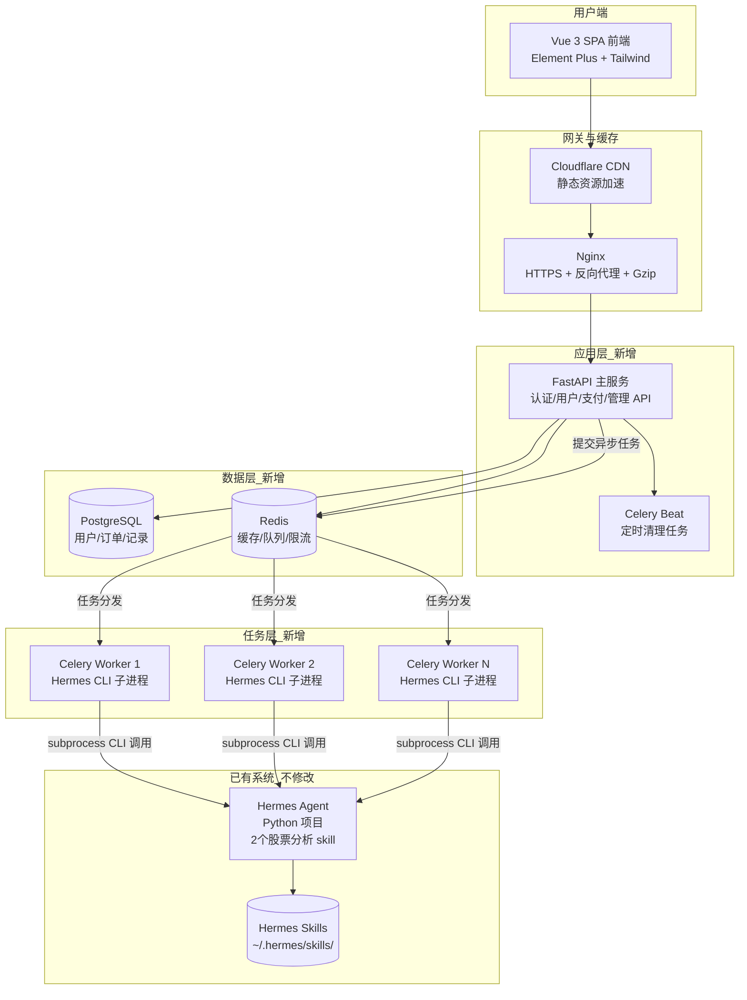
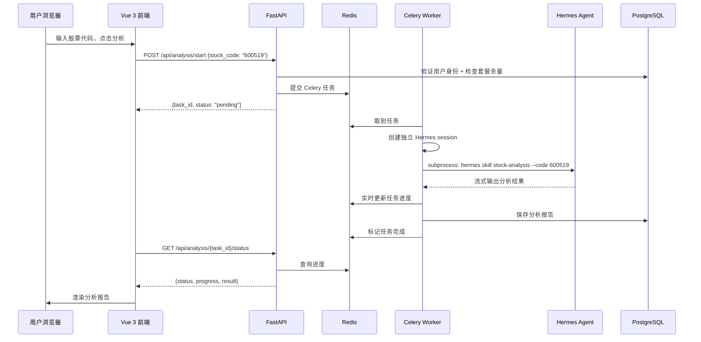

## 产品概述

将芝加哥 VPS 上已部署的 Hermes Agent（内含2个股票财报分析 skill）包装为一个面向个人投资者的付费 SaaS 网站。用户注册登录后，输入股票代码即可触发 Hermes 的财报分析 skill，获得专业的 AI 财务分析报告。平台支持微信支付和支付宝付费订阅，多用户并发访问。

核心原则：**不修改 Hermes 一行源码**，通过 CLI 子进程桥接实现集成。

## 核心功能

### 1. 股票财报分析

- 用户在前端输入股票代码或名称
- 后端通过 Celery 异步调用 Hermes CLI 触发财报分析 skill
- 每个用户分析任务分配独立 Hermes session，数据完全隔离
- 分析完成后，从 Hermes 输出中提取报告内容，格式化展示在前端
- 支持分析历史查看和报告导出（PDF/Word）

### 2. 用户系统

- 邮箱/手机号注册登录，JWT Token 鉴权
- 用户中心：个人信息、分析历史、当前套餐、剩余次数
- 密码找回（邮箱验证码）

### 3. 付费订阅

- 三档套餐：体验版（免费3次）、专业版（月/季/年）、企业版（年不限次）
- 微信支付 Native 扫码支付 + 支付宝扫码支付
- 订单管理、支付回调、套餐自动开通

### 4. 后台管理

- 用户管理、订单管理、套餐配置
- Hermes 状态监控（session 数、skill 调用成功率）
- 营收统计仪表盘

### 5. 多并发支持

- FastAPI 异步处理 HTTP 请求（高并发连接）
- Celery Worker 池并发执行 Hermes CLI 任务
- Redis 缓存 + 任务队列
- 每个 Worker 独立 Hermes session，互不干扰

## 技术栈

| 层级 | 技术 | 说明 |
| --- | --- | --- |
| 后端框架 | Python 3.11+ / FastAPI | 原生异步、高性能、自动 API 文档 |
| 任务队列 | Celery + Redis | 异步执行 Hermes CLI 调用 |
| 数据库 | PostgreSQL 15 | 用户、订单、分析记录 |
| ORM | SQLAlchemy 2.0 + Alembic | 异步 ORM、数据库迁移 |
| 前端 | Vue 3 + TypeScript + Vite | 组合式 API |
| UI 组件库 | Element Plus | 企业级 Vue 3 组件库 |
| 样式 | Tailwind CSS 3.4 | 原子化 CSS |
| Hermes 桥接 | Python subprocess (asyncio) | 不修改 Hermes 源码，CLI 调用 |
| PDF 报告 | PyMuPDF / WeasyPrint | 分析报告 PDF 导出 |
| 支付 | 微信支付 V3 / 支付宝 SDK | 扫码支付 + 回调 |
| 部署 | Docker Compose | 容器化一键部署 |
| CDN | Cloudflare (可选) | 加速国内用户访问芝加哥 VPS |


## 架构设计

### 整体架构



### 数据流



### 关键技术决策

1. **CLI 子进程桥接（非 MCP）**

- Hermes CLI 是最稳定的接口，MCP 协议可能因版本变化不稳定
- 每个 Celery Worker 通过 `asyncio.create_subprocess_exec` 调用 `hermes` CLI
- 子进程天然隔离用户 session，无需修改 Hermes 源码
- 超时控制：单次 skill 调用最长 10 分钟，超时自动 kill

2. **Session 隔离机制**

- 每个 Celery Worker 设置独立的 `HERMES_HOME` 环境变量（如 `/tmp/hermes_sessions/{task_id}/`）
- 确保不同用户的 skill 调用互不干扰
- 任务完成后自动清理临时 session 目录

3. **Hermes 输入输出解析**

- 输入：通过 CLI 参数传递股票代码、skill 名称
- 输出：解析 Hermes 标准输出的分析报告文本，提取为结构化 JSON
- 输送格式：约定 Hermes skill 输出特定标记（`---REPORT_START---` / `---REPORT_END---`），方便后端解析

4. **支付流程**

- 扫码支付模式：后端生成预支付订单，调用微信/支付宝 API 获取二维码链接
- 前端展示二维码，用户扫码支付
- 支付平台异步回调通知后端，更新订单状态和用户套餐

5. **CDN 加速**

- 前端静态资源部署到 Cloudflare CDN，解决芝加哥 VPS 到国内延迟问题
- API 请求通过 Nginx 反向代理直接访问 VPS
- 支付回调 URL 需要在微信/支付宝后台配置为 VPS 公网 IP

### 性能优化

- **Hermes 调用缓存**：同一股票代码 7 天内已有分析结果直接返回，不重复调用（财报数据短期内不变）
- **数据库索引**：analysis_records 表建立 user_id + stock_code + created_at 复合索引
- **Hermes 并发限制**：Celery Worker 数量 = 服务器 CPU 核心数，每个 Worker 同时只跑一个 Hermes 子进程
- **前端优化**：Vite 代码分割 + Element Plus 按需导入 + Nginx Gzip

## 目录结构

```
e:/股票分析系统/
├── docker-compose.yml              # Docker 编排：PostgreSQL + Redis + FastAPI + Celery + Nginx
├── .env.example                    # 环境变量模板
├── .gitignore
│
├── backend/                        # 新增后端
│   ├── Dockerfile
│   ├── requirements.txt
│   ├── alembic.ini
│   ├── alembic/versions/
│   ├── app/
│   │   ├── main.py                 # FastAPI 入口，CORS、路由挂载
│   │   ├── config.py               # 全局配置（从 .env 加载）
│   │   ├── database.py             # async SQLAlchemy engine
│   │   ├── dependencies.py         # 依赖注入：当前用户、DB session
│   │   ├── models/
│   │   │   ├── user.py             # User 表
│   │   │   ├── subscription.py     # SubscriptionPlan、UserSubscription
│   │   │   ├── order.py            # Order 订单表
│   │   │   └── analysis.py         # AnalysisTask 分析记录表
│   │   ├── schemas/
│   │   │   ├── user.py             # Pydantic Schema
│   │   │   ├── subscription.py
│   │   │   ├── order.py
│   │   │   └── analysis.py
│   │   ├── api/
│   │   │   ├── router.py           # 总路由注册
│   │   │   ├── auth.py             # 注册/登录/个人信息
│   │   │   ├── analysis.py         # 分析任务创建/查询/历史
│   │   │   ├── subscription.py     # 套餐列表/购买
│   │   │   ├── payment.py          # 支付回调
│   │   │   └── admin.py            # 后台管理接口
│   │   ├── services/
│   │   │   ├── auth_service.py     # 注册登录、JWT、密码哈希
│   │   │   ├── analysis_service.py # 分析任务管理
│   │   │   ├── subscription_service.py
│   │   │   ├── payment_service.py  # 微信/支付宝下单+回调
│   │   │   └── hermes_bridge.py    # Hermes CLI 桥接：subprocess 调用、输出解析、session 管理
│   │   ├── tasks/
│   │   │   ├── celery_app.py       # Celery 配置
│   │   │   └── analysis_tasks.py   # run_hermes_skill 异步任务
│   │   └── utils/
│   │       ├── security.py         # JWT 工具
│   │       └── rate_limiter.py     # Redis 限流
│   └── tests/
│
├── frontend/                       # 新增前端
│   ├── package.json
│   ├── vite.config.ts
│   ├── tsconfig.json
│   ├── index.html
│   ├── tailwind.config.js
│   ├── postcss.config.js
│   └── src/
│       ├── main.ts                 # Vue 入口
│       ├── App.vue
│       ├── router/index.ts
│       ├── stores/
│       │   ├── user.ts             # Pinia 用户状态
│       │   └── analysis.ts         # Pinia 分析状态
│       ├── api/
│       │   ├── client.ts           # Axios 封装
│       │   ├── auth.ts
│       │   ├── analysis.ts
│       │   ├── subscription.ts
│       │   └── admin.ts
│       ├── views/
│       │   ├── Home.vue            # 首页：搜索 + 功能介绍 + 套餐
│       │   ├── Login.vue
│       │   ├── Register.vue
│       │   ├── Analysis.vue        # 分析页：搜索 → 进度 → 报告
│       │   ├── History.vue         # 分析历史
│       │   ├── Subscription.vue    # 套餐选择 + 支付
│       │   ├── Profile.vue         # 个人中心
│       │   └── admin/
│       │       ├── Dashboard.vue
│       │       ├── Users.vue
│       │       ├── Orders.vue
│       │       └── Overview.vue
│       ├── components/
│       │   ├── layout/
│       │   │   ├── AppHeader.vue
│       │   │   └── AppFooter.vue
│       │   ├── analysis/
│       │   │   ├── AnalysisProgress.vue
│       │   │   └── AnalysisReport.vue
│       │   ├── payment/
│       │   │   ├── PlanCard.vue
│       │   │   └── QRCodeModal.vue
│       │   └── common/
│       │       ├── LoadingOverlay.vue
│       │       └── EmptyState.vue
│       └── styles/
│           └── index.css           # Tailwind 入口
│
└── nginx/
    ├── nginx.conf                  # Nginx 反向代理 + Gzip
    └── ssl/                        # SSL 证书目录
```

## 关键代码结构

### Hermes CLI 桥接接口

```python
# backend/app/services/hermes_bridge.py
import asyncio
import os
import tempfile

class HermesBridge:
    """通过 CLI 子进程调用 Hermes skill，不修改 Hermes 源码"""

    def __init__(self, hermes_home: str = None):
        self.hermes_home = hermes_home or os.path.expanduser("~/.hermes")

    async def run_skill(self, skill_name: str, stock_code: str, timeout: int = 600) -> dict:
        """
        调用 Hermes skill 分析股票
        返回: {"success": bool, "report": str, "error": str | None}
        """
        session_dir = tempfile.mkdtemp(prefix="hermes_session_")
        env = {**os.environ, "HERMES_HOME": session_dir}

        process = await asyncio.create_subprocess_exec(
            "hermes", "skill", skill_name,
            "--code", stock_code,
            stdout=asyncio.subprocess.PIPE,
            stderr=asyncio.subprocess.PIPE,
            env=env,
        )
        try:
            stdout, stderr = await asyncio.wait_for(
                process.communicate(), timeout=timeout
            )
            report = self._parse_report(stdout.decode())
            return {"success": True, "report": report}
        except asyncio.TimeoutError:
            process.kill()
            return {"success": False, "error": "分析超时"}
        finally:
            # 清理临时 session
            import shutil
            shutil.rmtree(session_dir, ignore_errors=True)

    def _parse_report(self, raw_output: str) -> str:
        """从 Hermes 输出中提取分析报告"""
        # 按约定标记解析
        ...
```

### 分析任务 Celery 任务

```python
# backend/app/tasks/analysis_tasks.py
from celery import shared_task

@shared_task(bind=True, max_retries=2)
def run_hermes_skill(self, task_id: str, skill_name: str, stock_code: str):
    """异步执行 Hermes skill 分析"""
    from app.services.hermes_bridge import HermesBridge
    bridge = HermesBridge()
    result = await bridge.run_skill(skill_name, stock_code)
    # 更新数据库、Redis 进度...
```

### API 请求/响应

```python
# POST /api/analysis/start
class AnalysisRequest(BaseModel):
    stock_code: str           # "600519"

class AnalysisResponse(BaseModel):
    task_id: str
    status: str               # "pending"
    estimated_seconds: int    # 180

# GET /api/analysis/{task_id}/status
class AnalysisStatusResponse(BaseModel):
    task_id: str
    status: str               # pending/running/completed/failed
    progress: float           # 0.0 - 1.0
    result: dict | None
```

## 设计风格

采用现代金融科技风格的深色主题，营造专业、沉稳、可信赖的分析平台气质。主色调为深蓝渐变 + 金色点缀，传递"AI 驱动投资决策"的品牌调性。UI 采用卡片式布局，大量运用微交互动效和毛玻璃效果提升操作体验。

### 页面规划

**首页 (Home)**

- 顶部全宽 Hero Banner：深蓝渐变背景 + 粒子动效，金色标题"AI 财报分析平台"，居中搜索框支持股票代码自动补全
- 中部三列功能亮点卡片（智能财报下载、AI 深度分析、专业报告导出），hover 卡片上浮 + 阴影加深
- 底部三档套餐对比表，高亮推荐专业版，金色边框 + 热门标签

**分析页 (Analysis)**

- 顶部搜索区：股票搜索框 + 分析按钮
- 中间进度区：垂直步骤指示器（提交→分析中→生成报告），当前阶段呼吸动画
- 底部结果区：左右分栏，左侧目录导航，右侧 Markdown 渲染报告，支持一键导出 PDF/Word

**登录/注册页**

- 居中卡片式表单，背景深蓝渐变 + 几何线条图案

**会员页 (Subscription)**

- 三列套餐卡片，推荐套餐金色边框，底部"立即购买"触发支付二维码弹窗

**管理后台 (Admin)**

- 左侧导航菜单，右侧内容区，仪表盘 KPI 卡片 + 折线图

### 交互细节

- 搜索框输入时下拉自动补全股票列表
- 分析进度 SSE 实时推送
- 支付二维码 30 分钟倒计时，支付成功自动关闭弹窗
- 按钮 hover 微动画（上浮 2px + 阴影加深）