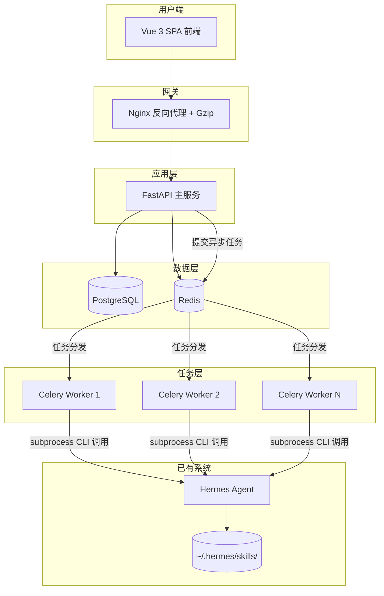
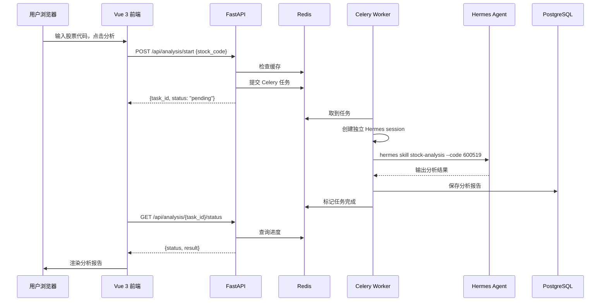

## 产品概述

将芝加哥 VPS 上已部署的 Hermes Agent（内含2个股票财报分析 skill）包装为 Web 网站。用户输入股票代码，系统通过 Hermes CLI 触发分析 skill，返回 AI 财务分析报告。本期先跑通核心链路，不做注册、支付、后台管理。

核心原则：**不修改 Hermes 一行源码**，通过 CLI 子进程桥接实现集成。

## 核心功能

- 用户在前端输入股票代码或名称，点击分析
- 后端通过 Celery 异步调用 Hermes CLI 触发财报分析 skill
- 分析完成后从 Hermes 输出中提取报告内容，格式化展示在前端
- 分析结果缓存（同一股票7天内不重复分析）
- FastAPI 异步高并发 + Celery Worker 池 + Redis 队列

## 技术栈

| 层级 | 技术 | 说明 |
| --- | --- | --- |
| 后端框架 | Python 3.11+ / FastAPI | 原生异步、自动 API 文档 |
| 任务队列 | Celery + Redis | 异步执行 Hermes CLI 调用 |
| 数据库 | PostgreSQL 15 | 分析任务记录 |
| ORM | SQLAlchemy 2.0 + Alembic | 异步 ORM、数据库迁移 |
| 前端 | Vue 3 + TypeScript + Vite | 组合式 API |
| UI 组件库 | Element Plus | 企业级 Vue 3 组件库 |
| 样式 | Tailwind CSS 3.4 | 原子化 CSS |
| Hermes 桥接 | Python subprocess (asyncio) | 不修改 Hermes 源码 |
| 部署 | Docker Compose | 一键部署 |


## 整体架构



## 数据流



## 关键技术决策

1. **CLI 子进程桥接**：用 `asyncio.create_subprocess_exec` 调用 Hermes CLI，超时 10 分钟自动 kill
2. **Session 隔离**：每个 Worker 设独立 `HERMES_HOME` 临时目录，任务结束自动清理
3. **结果解析**：约定 Hermes skill 输出标记便于后端解析，无标记则直接保存原文
4. **缓存策略**：同股票代码 7 天内直接返回缓存结果

## 性能优化

- 数据库索引：analysis_tasks 表 stock_code + created_at 复合索引
- Celery Worker 数 = CPU 核心数，每 Worker 同时只跑一个子进程
- Vite 代码分割 + Element Plus 按需导入 + Nginx Gzip

## 目录结构

```
e:/股票分析系统/
├── docker-compose.yml
├── .env.example
├── .gitignore
│
├── backend/
│   ├── Dockerfile
│   ├── requirements.txt
│   ├── alembic.ini
│   ├── alembic/versions/
│   ├── app/
│   │   ├── main.py                 # FastAPI 入口，CORS、路由挂载
│   │   ├── config.py               # 全局配置（从 .env 加载）
│   │   ├── database.py             # async SQLAlchemy engine
│   │   ├── models/
│   │   │   └── analysis.py         # AnalysisTask 分析记录表
│   │   ├── schemas/
│   │   │   └── analysis.py         # Pydantic 请求/响应 Schema
│   │   ├── api/
│   │   │   ├── router.py           # 总路由注册
│   │   │   └── analysis.py         # POST /start, GET /{id}/status, GET /history
│   │   ├── services/
│   │   │   ├── analysis_service.py # 分析任务管理
│   │   │   └── hermes_bridge.py    # Hermes CLI 桥接层
│   │   ├── tasks/
│   │   │   ├── celery_app.py       # Celery 配置
│   │   │   └── analysis_tasks.py   # run_hermes_skill 异步任务
│   │   └── utils/
│   │       └── rate_limiter.py     # Redis 滑动窗口限流
│   └── tests/
│
├── frontend/
│   ├── package.json
│   ├── vite.config.ts
│   ├── tsconfig.json
│   ├── tsconfig.app.json
│   ├── tsconfig.node.json
│   ├── index.html
│   ├── tailwind.config.js
│   ├── postcss.config.js
│   └── src/
│       ├── main.ts                 # Vue 入口
│       ├── App.vue
│       ├── router/index.ts         # / 首页, /analysis 分析页
│       ├── stores/analysis.ts      # Pinia 分析状态
│       ├── api/
│       │   ├── client.ts           # Axios 封装
│       │   └── analysis.ts         # 分析 API 调用
│       ├── views/
│       │   ├── Home.vue            # 首页：搜索 + 功能介绍
│       │   └── Analysis.vue        # 分析页：搜索→进度→报告
│       ├── components/
│       │   ├── layout/
│       │   │   ├── AppHeader.vue   # 顶部导航栏
│       │   │   └── AppFooter.vue   # 底部
│       │   ├── analysis/
│       │   │   ├── AnalysisProgress.vue  # 进度指示器
│       │   │   └── AnalysisReport.vue    # 报告渲染
│       │   └── common/
│       │       └── LoadingOverlay.vue     # 加载遮罩
│       └── styles/
│           └── index.css           # Tailwind 入口
│
└── nginx/
    └── nginx.conf                  # 反向代理 + Gzip
```

## 关键代码结构

### Hermes CLI 桥接接口

```python
# backend/app/services/hermes_bridge.py
import asyncio, os, tempfile, shutil

class HermesBridge:
    def __init__(self, hermes_home: str = None):
        self.hermes_home = hermes_home or os.path.expanduser("~/.hermes")

    async def run_skill(self, skill_name: str, stock_code: str, timeout: int = 600) -> dict:
        session_dir = tempfile.mkdtemp(prefix="hermes_session_")
        env = {**os.environ, "HERMES_HOME": session_dir}
        process = await asyncio.create_subprocess_exec(
            "hermes", "skill", skill_name, "--code", stock_code,
            stdout=asyncio.subprocess.PIPE, stderr=asyncio.subprocess.PIPE, env=env)
        try:
            stdout, stderr = await asyncio.wait_for(process.communicate(), timeout=timeout)
            return {"success": True, "report": stdout.decode(), "stderr": stderr.decode()}
        except asyncio.TimeoutError:
            process.kill()
            return {"success": False, "error": "分析超时，请稍后重试"}
        finally:
            shutil.rmtree(session_dir, ignore_errors=True)
```

### API 接口设计

```
POST /api/analysis/start   Body: {"stock_code": "600519"}  →  {task_id, status: "pending"}
GET  /api/analysis/{id}/status                              →  {task_id, status, progress, result}
GET  /api/analysis/history?stock_code=600519                 →  {items: [...], total}
GET  /api/analysis/history?page=1&size=10                    →  {items: [...], total, page, size}
```

### AnalysisTask 模型

```python
# backend/app/models/analysis.py
class AnalysisTask(Base):
    __tablename__ = "analysis_tasks"
    id: Mapped[int] = mapped_column(primary_key=True)
    task_id: Mapped[str] = mapped_column(String(64), unique=True, index=True)
    stock_code: Mapped[str] = mapped_column(String(20), index=True)
    stock_name: Mapped[str | None] = mapped_column(String(100))
    skill_name: Mapped[str] = mapped_column(String(100))
    status: Mapped[str] = mapped_column(String(20), default="pending")  # pending/running/completed/failed
    result: Mapped[str | None] = mapped_column(Text)
    error: Mapped[str | None] = mapped_column(Text)
    created_at: Mapped[datetime] = mapped_column(default=func.now())
    completed_at: Mapped[datetime | None] = mapped_column()
```

## 设计风格

现代金融科技深色主题，深蓝渐变背景 + 金色点缀，毛玻璃卡片布局。专业沉稳、Premium 感。

## 页面规划

**首页 (Home)**

- 顶部全宽 Hero Banner：深蓝渐变背景 + 微粒子动效，金色标题"AI 财报分析平台"，居中搜索框支持股票代码自动补全
- 中部三列功能亮点卡片（智能财报下载、AI 深度分析、专业报告导出），hover 上浮 + 阴影加深
- 底部系统状态栏（已分析报告数、覆盖股票数、今日分析次数）

**分析页 (Analysis)**

- 顶部搜索区：固定搜索框，支持股票代码/名称输入 + "开始分析"按钮
- 中间进度区：步骤指示器（提交任务 → 分析中 → 生成报告），当前阶段呼吸动画
- 底部结果区：左右分栏，左侧目录导航，右侧 Markdown 渲染分析报告，支持一键复制