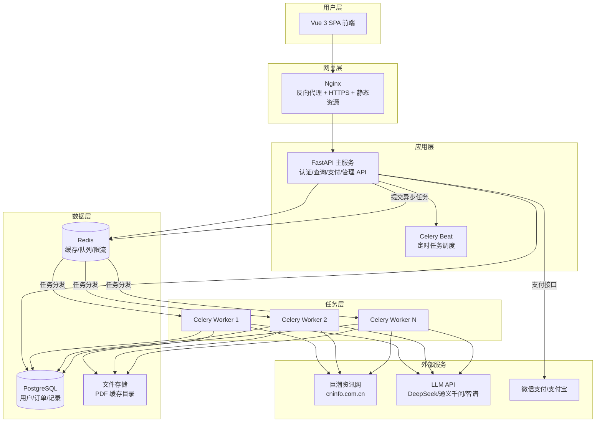
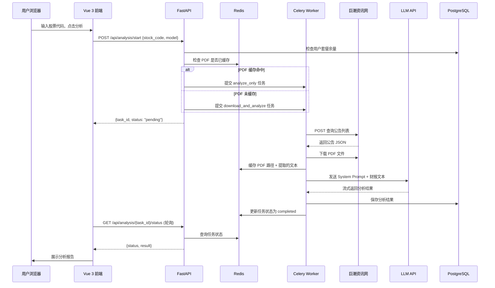

## 产品概述

一个面向个人投资者的 A 股/港股财报 AI 分析 SaaS 平台。用户输入股票代码或名称，系统自动从巨潮资讯网下载近 5 年年报及最新定期报告 PDF，提取文本后调用国内大模型（DeepSeek/通义千问/智谱）进行深度财务分析，输出基于《手把手教你读财报》方法论的专业分析报告。平台采用付费订阅制，支持微信支付和支付宝。

## 核心功能

### 1. 财报下载与分析

- 支持 A 股（沪深）和港股上市公司财报查询
- 自动下载近 5 年年报 + 当年 Q1/半年/Q3 定期报告 PDF
- PDF 文本提取后送入 LLM，按财务分析师角色输出分析报告
- 分析结果包含：公司概况、财务指标解读、风险检测、估值分析、投资建议

### 2. 用户系统

- 邮箱/手机号注册登录，JWT Token 鉴权
- 用户中心：查看分析历史、当前套餐、剩余次数
- 支持密码找回

### 3. 付费订阅

- 三档套餐：体验版（免费 3 次）、专业版（月度/季度/年度）、企业版（年度不限次）
- 微信支付 + 支付宝扫码支付
- 订单管理、发票申请、自动续费（可选）

### 4. 多模型切换

- 管理员后台可配置多个 LLM 模型（DeepSeek V3、通义千问、智谱 GLM-4 等）
- 不同套餐对应不同模型级别（体验版用便宜模型，专业版用高级模型）
- 模型故障自动降级切换

### 5. 后台管理

- 用户管理、订单管理、套餐配置、模型管理
- 系统监控：下载成功率、API 调用量、收入统计仪表盘

### 6. 多并发支持

- FastAPI 原生异步处理 HTTP 请求
- Celery 异步任务队列处理下载和分析
- Redis 缓存已下载的 PDF，避免重复爬取
- 数据库连接池、LLM API 并发限流控制

## 技术栈

| 层级 | 技术选型 | 说明 |
| --- | --- | --- |
| 后端框架 | Python 3.11+ / FastAPI | 原生异步、自动 OpenAPI 文档、高性能 |
| 任务队列 | Celery + Redis | 异步处理下载和分析任务 |
| 数据库 | PostgreSQL 15 | 用户、订单、分析记录 |
| ORM | SQLAlchemy 2.0 + Alembic | 异步 ORM，数据库迁移 |
| 缓存 | Redis | PDF 缓存、Session、限流 |
| 前端框架 | Vue 3 + TypeScript | 组合式 API |
| UI 组件库 | Element Plus | 企业级 Vue 3 组件库 |
| 前端构建 | Vite | 快速冷启动和 HMR |
| PDF 解析 | PyMuPDF (fitz) | 高性能 PDF 文本提取 |
| HTTP 客户端 | httpx (async) | 异步下载，连接池复用 |
| LLM SDK | OpenAI Python SDK (兼容多 API) | DeepSeek/通义千问/智谱均兼容 OpenAI 接口 |
| 支付 | 微信支付 V3 API / 支付宝开放平台 | 扫码支付 |
| 反向代理 | Nginx | 静态文件服务 + API 代理 + HTTPS |
| 容器化 | Docker Compose | 一键部署 |


## 实现方案

### 总体策略

将原 CNinfo2Notebookllm 项目的核心下载逻辑完整保留并异步化改造，丢弃 NotebookLM 上传模块，新增 LLM 分析引擎替代。以 FastAPI 作为 Web 服务框架，Celery 作为异步任务引擎，构建完整的 SaaS 平台。

### 核心架构



### 数据流



### 关键技术决策

1. **保留原下载逻辑而非重写**：download.py 经过充分测试，A 股/港股双市场兼容、标题过滤逻辑复杂，重写风险高。改为将其封装为可异步调用的模块，增加异常重试和超时控制。

2. **PDF 缓存策略**：同一股票同一年份的 PDF 永久缓存，避免重复爬取触发反爬。缓存在本地磁盘（生产环境可切换为对象存储），Redis 中只存文件路径映射。

3. **LLM 分析而非 RAG**：采用"提取全文 → 一次性发送给 LLM"的方式而非 RAG 分段检索。一份年报通常 100-300 页，提取后约 50K-150K tokens，DeepSeek V3（128K 上下文）可直接处理。对于超长报告，按章节分片后汇总。

4. **LLM 多模型抽象**：定义统一的 `LLMProvider` 抽象基类，各模型实现 `analyze(text, system_prompt)` 方法。通过数据库配置表动态加载，支持热切换。

5. **支付流程**：采用扫码支付模式（Native 支付）。后端生成预支付订单 → 调用微信/支付宝 API 获取二维码链接 → 前端展示二维码 → 用户扫码支付 → 支付平台回调通知 → 后端更新订单状态和用户套餐。

### 性能优化

- **数据库索引**：在 stocks.json 导入后的股票表上建立 code、name 索引；分析记录表上建立 user_id + created_at 复合索引
- **LLM 并发控制**：使用 asyncio.Semaphore 限制同时调用 LLM API 的数量，避免超 API 并发上限
- **巨潮反爬**：每次请求间隔 0.5-1.5 秒随机延迟；维护多个 JSESSIONID Cookie 轮换；下载失败自动重试 3 次
- **前端首屏**：Vite 代码分割 + Element Plus 按需导入 + Nginx Gzip 压缩

## 目录结构

```
stock-analysis-platform/
├── docker-compose.yml              # [NEW] Docker 编排：PostgreSQL + Redis + FastAPI + Celery + Nginx
├── .env.example                    # [NEW] 环境变量模板
├── .gitignore
│
├── backend/                        # 后端服务
│   ├── Dockerfile                  # [NEW] FastAPI 镜像
│   ├── requirements.txt            # [NEW] Python 依赖
│   ├── alembic.ini                 # [NEW] 数据库迁移配置
│   ├── alembic/                    # [NEW] 迁移脚本目录
│   │   └── versions/
│   ├── app/
│   │   ├── main.py                 # [NEW] FastAPI 应用入口，挂载路由、中间件、CORS
│   │   ├── config.py               # [NEW] 全局配置：从 .env 加载数据库/Redis/LLM/支付密钥
│   │   ├── database.py             # [NEW] SQLAlchemy async engine + session 工厂
│   │   ├── dependencies.py         # [NEW] FastAPI 依赖注入：当前用户、数据库会话
│   │   │
│   │   ├── models/                 # [NEW] 数据模型层
│   │   │   ├── __init__.py
│   │   │   ├── user.py             # [NEW] User：id, email, phone, hashed_password, created_at
│   │   │   ├── subscription.py     # [NEW] SubscriptionPlan（套餐定义）、UserSubscription（用户订阅）
│   │   │   ├── order.py            # [NEW] Order：订单号、金额、状态、支付方式、回调信息
│   │   │   ├── stock.py            # [NEW] Stock：从 stocks.json 导入的股票代码/名称/市场映射
│   │   │   ├── analysis.py         # [NEW] AnalysisTask：任务ID、股票、用户、状态、结果JSON
│   │   │   └── llm_config.py       # [NEW] LLMConfig：模型名称、API Key、Endpoint、优先级
│   │   │
│   │   ├── schemas/                # [NEW] Pydantic 请求/响应模型
│   │   │   ├── __init__.py
│   │   │   ├── user.py             # 注册/登录/用户信息 Schema
│   │   │   ├── subscription.py     # 套餐/订阅 Schema
│   │   │   ├── order.py            # 订单创建/回调 Schema
│   │   │   ├── analysis.py         # 分析请求/响应/结果 Schema
│   │   │   └── stock.py            # 股票搜索/详情 Schema
│   │   │
│   │   ├── api/                    # [NEW] 路由层
│   │   │   ├── __init__.py
│   │   │   ├── router.py           # [NEW] 总路由注册
│   │   │   ├── auth.py             # [NEW] POST /auth/register, /auth/login, /auth/me
│   │   │   ├── stock.py            # [NEW] GET /stocks/search?keyword=, GET /stocks/{code}
│   │   │   ├── analysis.py         # [NEW] POST /analysis/start, GET /analysis/{id}/status, GET /analysis/history
│   │   │   ├── subscription.py     # [NEW] GET /subscriptions/plans, POST /subscriptions/order
│   │   │   ├── payment.py          # [NEW] POST /payment/wxpay/callback, POST /payment/alipay/callback
│   │   │   └── admin.py            # [NEW] 管理员接口：用户/订单/模型管理
│   │   │
│   │   ├── services/               # [NEW] 业务逻辑层
│   │   │   ├── __init__.py
│   │   │   ├── auth_service.py     # [NEW] 注册、登录、JWT 生成/验证、密码哈希
│   │   │   ├── stock_service.py    # [NEW] 股票搜索、信息查询
│   │   │   ├── analysis_service.py # [NEW] 创建分析任务、查询任务状态、历史记录
│   │   │   ├── subscription_service.py  # [NEW] 套餐查询、用户订阅管理、次数扣减
│   │   │   ├── payment_service.py  # [NEW] 微信支付/支付宝下单、签名验证、回调处理
│   │   │   └── llm_service.py      # [NEW] LLM 提供者抽象 + 多模型管理 + 故障切换
│   │   │
│   │   ├── engine/                 # [NEW] 核心引擎（改造自 CNinfo2Notebookllm）
│   │   │   ├── __init__.py
│   │   │   ├── downloader.py       # [NEW] CnInfoDownloader：封装原 download.py 逻辑，异步 httpx，代理支持
│   │   │   ├── pdf_extractor.py    # [NEW] PDF 文本提取：PyMuPDF，分页/分章节提取
│   │   │   ├── analyzer.py         # [NEW] 财报分析器：构造 prompt、调用 LLM、解析结果
│   │   │   └── prompt.py           # [NEW] 加载 financial_analyst_prompt.txt，支持模板变量
│   │   │
│   │   ├── tasks/                  # [NEW] Celery 异步任务
│   │   │   ├── __init__.py
│   │   │   ├── celery_app.py       # [NEW] Celery 实例配置，Redis broker + result backend
│   │   │   ├── analysis_tasks.py   # [NEW] download_and_analyze、analyze_only 任务定义
│   │   │   └── cleanup_tasks.py    # [NEW] 定期清理过期 PDF 缓存、过期任务
│   │   │
│   │   └── utils/                  # [NEW] 工具函数
│   │       ├── __init__.py
│   │       ├── security.py         # [NEW] JWT 生成/验证、密码哈希（bcrypt）
│   │       └── rate_limiter.py     # [NEW] Redis 滑动窗口限流
│   │
│   └── data/                       # [NEW] 静态数据
│       ├── stocks.json             # [COPY] 从原项目复制，股票代码映射数据库（10MB）
│       └── financial_analyst_prompt.txt  # [COPY] 财务分析 System Prompt 模板
│
├── frontend/                       # 前端项目
│   ├── package.json                # [NEW] Vue 3 + Element Plus + Vite
│   ├── vite.config.ts              # [NEW] Vite 配置：代理、别名、打包优化
│   ├── tsconfig.json               # [NEW] TypeScript 配置
│   ├── index.html                  # [NEW] 入口 HTML
│   └── src/
│       ├── main.ts                 # [NEW] Vue 应用入口，注册 Element Plus、路由、状态管理
│       ├── App.vue                 # [NEW] 根组件
│       ├── router/
│       │   └── index.ts            # [NEW] 路由定义：首页/登录/注册/分析/历史/会员/管理
│       ├── stores/
│       │   ├── user.ts             # [NEW] Pinia 用户状态：登录信息、JWT、套餐信息
│       │   └── analysis.ts         # [NEW] Pinia 分析状态：当前任务、历史列表
│       ├── api/
│       │   ├── client.ts           # [NEW] Axios 实例封装：拦截器、JWT 注入、错误处理
│       │   ├── auth.ts             # [NEW] 认证 API 调用
│       │   ├── stock.ts            # [NEW] 股票搜索 API
│       │   ├── analysis.ts         # [NEW] 分析创建/查询 API
│       │   ├── subscription.ts     # [NEW] 套餐/支付 API
│       │   └── admin.ts            # [NEW] 管理后台 API
│       ├── views/
│       │   ├── Home.vue            # [NEW] 首页：搜索框 + 功能展示 + 套餐介绍
│       │   ├── Login.vue           # [NEW] 登录页
│       │   ├── Register.vue        # [NEW] 注册页
│       │   ├── Analysis.vue        # [NEW] 分析页：搜索 → 等待 → 结果展示
│       │   ├── History.vue         # [NEW] 分析历史列表
│       │   ├── Subscription.vue    # [NEW] 套餐选择 + 支付二维码
│       │   ├── Profile.vue         # [NEW] 个人中心
│       │   └── admin/              # [NEW] 管理后台
│       │       ├── Dashboard.vue   # [NEW] 管理仪表盘
│       │       ├── Users.vue       # [NEW] 用户管理
│       │       ├── Orders.vue      # [NEW] 订单管理
│       │       └── Models.vue      # [NEW] LLM 模型配置
│       ├── components/
│       │   ├── layout/
│       │   │   ├── AppHeader.vue   # [NEW] 顶部导航栏：Logo、菜单、用户头像/登录按钮
│       │   │   └── AppFooter.vue   # [NEW] 底部：版权、备案号、联系方式
│       │   ├── stock/
│       │   │   ├── StockSearch.vue # [NEW] 股票搜索自动补全组件
│       │   │   └── StockCard.vue   # [NEW] 股票信息卡片
│       │   ├── analysis/
│       │   │   ├── AnalysisProgress.vue  # [NEW] 分析进度指示器：下载/分析/完成
│       │   │   └── AnalysisReport.vue    # [NEW] 分析报告渲染组件
│       │   ├── payment/
│       │   │   ├── PlanCard.vue    # [NEW] 套餐卡片
│       │   │   └── QRCodeModal.vue # [NEW] 支付二维码弹窗
│       │   └── common/
│       │       ├── LoadingOverlay.vue  # [NEW] 加载遮罩
│       │       └── EmptyState.vue      # [NEW] 空状态提示
│       └── styles/
│           ├── variables.scss      # [NEW] SCSS 变量：主题色、字体
│           └── global.scss         # [NEW] 全局样式重置和公共样式
│
└── nginx/
    ├── nginx.conf                  # [NEW] Nginx 配置：反向代理、静态文件、Gzip、HTTPS
    └── ssl/                        # [NEW] SSL 证书目录（部署时放置）
```

## 关键代码结构

### LLM Provider 抽象接口

```python
# backend/app/services/llm_service.py
from abc import ABC, abstractmethod
from dataclasses import dataclass

@dataclass
class LLMResult:
    content: str
    model: str
    tokens_used: int
    cost: float

class LLMProvider(ABC):
    """统一的大模型提供者抽象"""
    @abstractmethod
    async def analyze(self, system_prompt: str, user_content: str) -> LLMResult:
        """发送分析请求，返回结果"""
        ...

class DeepSeekProvider(LLMProvider):
    def __init__(self, api_key: str, model: str = "deepseek-chat"):
        self.client = AsyncOpenAI(api_key=api_key, base_url="https://api.deepseek.com/v1")
        self.model = model

class QwenProvider(LLMProvider):
    def __init__(self, api_key: str, model: str = "qwen-max"):
        self.client = AsyncOpenAI(api_key=api_key, base_url="https://dashscope.aliyuncs.com/compatible-mode/v1")
        self.model = model

class ZhipuProvider(LLMProvider):
    def __init__(self, api_key: str, model: str = "glm-4"):
        self.client = AsyncOpenAI(api_key=api_key, base_url="https://open.bigmodel.cn/api/paas/v4")
        self.model = model

class LLMManager:
    """多模型管理器：按优先级选择、故障自动切换"""
    async def analyze_with_fallback(self, system_prompt: str, content: str, preferred_model: str | None = None) -> LLMResult:
        ...
```

### 下载引擎改造要点

原 `download.py` 的核心类 `CnInfoDownloader` 保持逻辑不变，改造为：

- 将 `httpx` 调用改为 async（`await client.post(...)`）
- 增加代理配置（`proxies` 参数，支持 HTTP/SOCKS5 代理池轮换）
- 增加重试装饰器（max_retries=3, exponential backoff）
- 增加 Cookie 池（多个 JSESSIONID 轮换使用）
- 输出路径统一到配置的 `PDF_CACHE_DIR`

### API 请求/响应关键结构

```python
# POST /api/analysis/start
class AnalysisRequest(BaseModel):
    stock_code: str          # "600519" 或 "00700"
    model_name: str | None   # 可选指定模型
    years: int = 5           # 分析近N年年报

class AnalysisResponse(BaseModel):
    task_id: str             # Celery task UUID
    status: str              # "pending"
    estimated_seconds: int   # 预估耗时

# GET /api/analysis/{task_id}/status
class AnalysisStatusResponse(BaseModel):
    task_id: str
    status: str              # pending/downloading/analyzing/completed/failed
    progress: float          # 0.0 - 1.0
    result: dict | None      # 完成后返回分析报告 JSON
    error: str | None
```

## 部署方案

使用 Docker Compose 一键部署，包含 6 个服务容器：

| 服务 | 镜像 | 端口 | 说明 |
| --- | --- | --- | --- |
| nginx | nginx:alpine | 80/443 | 反向代理 + 静态资源 |
| backend | 自构建 | 8000 (内部) | FastAPI 主服务 |
| celery-worker | 自构建 | - | 异步任务执行（可扩展 N 个实例） |
| celery-beat | 自构建 | - | 定时任务调度 |
| postgres | postgres:15-alpine | 5432 (内部) | 数据库 |
| redis | redis:7-alpine | 6379 (内部) | 缓存/队列 |


## 设计风格

采用现代金融风格的深色主题设计，营造专业、沉稳、可信赖的分析平台气质。主色调选用深蓝渐变 + 金色点缀，传递"专业金融分析"的品牌调性。UI 采用卡片式布局，大量运用微交互动效提升操作体验。

### 页面规划

**首页 (Home)**

- 顶部：全宽 Hero Banner，深蓝渐变背景 + 金色标题"AI 财报分析平台"，居中搜索框支持股票代码/名称自动补全，下方展示"已分析 12800+ 份财报"等数据
- 中部：三列功能亮点卡片（智能财报下载、AI 深度分析、专业投资建议），图标 + 说明文字，hover 卡片上浮
- 底部：三档套餐对比表（体验版/专业版/企业版），高亮推荐专业版，黄色"立即开通"按钮

**分析页 (Analysis)**

- 顶部搜索区：搜索框 + 模型选择下拉（默认自动选择）+ 分析按钮
- 中间进度区：垂直步骤指示器，显示"搜索股票 → 下载财报 → AI 分析中 → 生成报告"四个阶段，当前阶段高亮呼吸动画
- 底部结果区：分析报告采用左右分栏布局，左侧目录导航，右侧 Markdown 渲染报告内容（财报关键指标、风险提示、估值分析、总结建议），报告区域支持导出 PDF

**登录/注册页**

- 居中卡片式表单，背景为深蓝渐变 + 网格图案，右侧展示平台功能插图

**会员页 (Subscription)**

- 三列套餐卡片横向排列，推荐套餐带"热门"标签和金色边框，每张卡片展示价格/分析次数/模型级别/功能对比，底部"立即购买"按钮触发支付二维码弹窗

**个人中心 (Profile)**

- 左侧个人信息卡片（头像、邮箱、会员状态），右侧分析历史列表（表格展示：股票名称、分析时间、模型、操作按钮）

**管理后台 (Admin)**

- 左侧导航菜单（仪表盘/用户管理/订单管理/模型配置），右侧内容区。仪表盘展示 KPI 卡片（今日分析数、活跃用户、收入、API 调用量）+ 折线图

### 交互细节

- 搜索框输入时下拉显示匹配的股票列表，含代码、名称、市场标签
- 分析进度采用 SSE（Server-Sent Events）实时推送，无需轮询
- 支付弹窗展示二维码，30 分钟倒计时，支付成功后自动关闭并跳转
- 报告内容支持一键复制和 PDF 导出
- 所有按钮和卡片有 hover 微动画（上浮、阴影加深、颜色过渡）

## Agent Extensions

### Skill

- **pdf**
- 用途：在开发阶段用于测试 PDF 解析功能，验证 PyMuPDF 提取财报文本的准确性和完整性
- 预期结果：确认 PDF 文本提取的格式正确，无乱码，表格数据保留

- **xlsx**
- 用途：开发管理后台的数据导出功能，支持将用户分析记录、订单数据导出为 Excel 表格
- 预期结果：生成格式化的 Excel 报表供管理员下载

- **docx**
- 用途：实现分析报告的 Word 文档导出功能，用户可将 AI 分析报告下载为 .docx 格式
- 预期结果：生成包含完整格式的 Word 分析报告文档

- **skill-creator**
- 用途：在项目中创建一个自定义 skill，封装财报分析的核心流程，方便后续维护和扩展
- 预期结果：创建 `stock-analysis` skill，封装下载→分析→报告生成的完整工作流